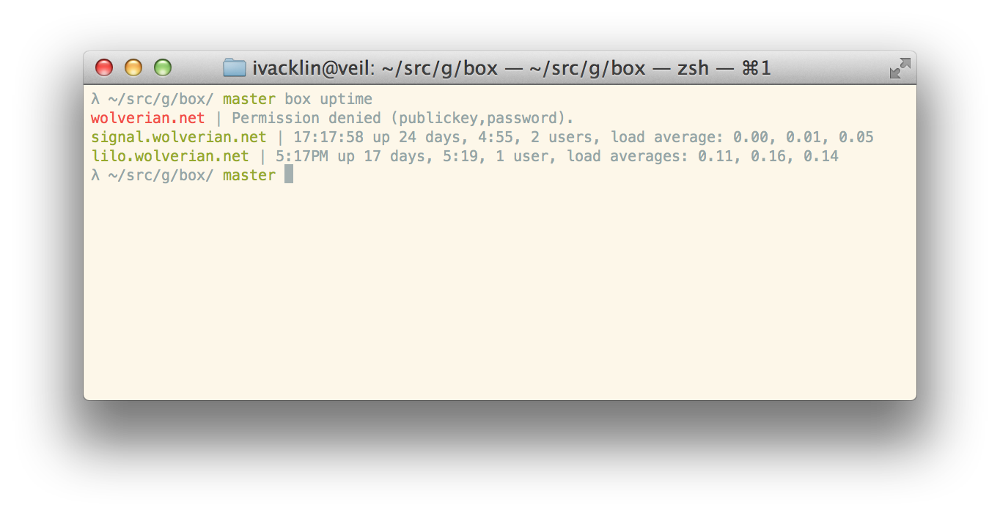

# Box is full of boxes

> I just *know* I have a Debian box somewhere…

Do you have more than π boxes? Are you constantly forgetting about them?

With Box you can easily:

- Keep inventory of your boxes:

        $ box ls
        me@foo.bar.com
        i@bar.baz.net
        myself@quux.org

- Check if they're up:

        $ box uptime
        me@foo.bar.com | 15:29:49 up 24 days, 3:07, 2 users, load average: 0.00, 0.01, 0.05
        i@bar.baz.net | 3:29PM up 17 days, 3:31, 1 user, load averages: 0.20, 0.14, 0.09
        myself@quux.org | 3:29PM up 42 days, 1:44, 15 users, load averages: 1.30, 1.94, 1.88

- Remind yourself what you put in those boxes:

        $ box id
        me@foo.bar.com | Linux foo 3.5.0-17-generic i686
        i@bar.baz.net | NetBSD bar 6.0.1 amd64
        myself@quux.org | Linux quux 2.6.34-generic amd64

All this and more, for the low price of *nothing*! Get Box today!

## Overview

Box is a remote command execution program. Box allows you to run commands on
all of your servers and presents the produced results in a readable format.

Box is liberally licensed with the [ISC license][].

In the future, Box will likely morph into a minimal configuration management
system.

## Who Box is for

Box is designed for managing at most twentyish boxes. If you have a larger
deployment, we recommend that you use tools like [Ansible][], [Salt Stack][],
[Chef][] or [Puppet][] (in roughly increasing order of complexity).

## Requirements

- A POSIX `/bin/sh` implementation on boxes and on the controlling machine.
- Access to boxes with an SSH key.
- Box runs commands in parallel on each box if [GNU Parallel] is installed.

## Getting started

Box doesn't have a an installation method yet. You can run it easily from a
Git clone, though:

    git clone git@github.com:wolverian/box.git
    cd box
    echo user1@host1.com >> etc/hosts
    echo user2@host2.com >> etc/hosts
    PATH=bin:$PATH
    box tasks
    …
    box id
    …

[GNU Parallel]: http://www.gnu.org/software/parallel/
[Salt Stack]: http://saltstack.org
[Chef]: http://www.opscode.com/chef/
[Puppet]: https://puppetlabs.com
[Ansible]: http://ansible.cc
[ISC license]: LICENSE